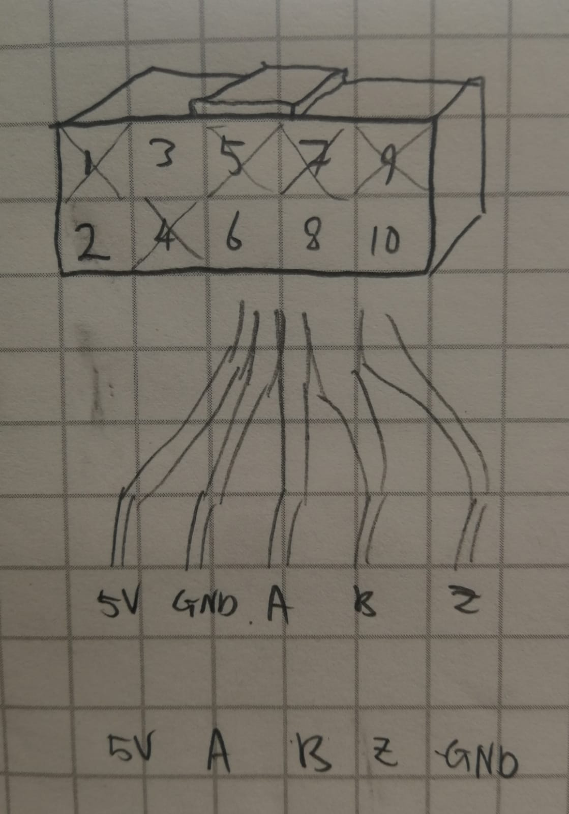
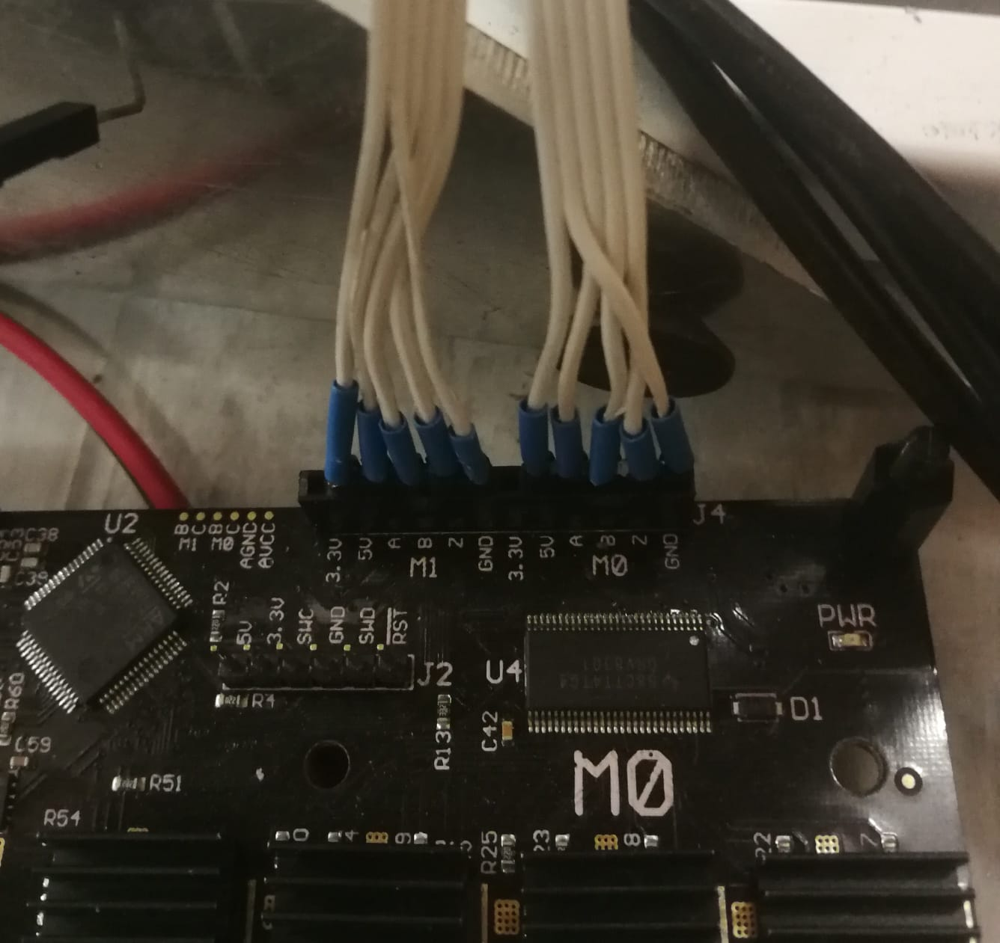

# Foot Design Project

## TODO:
<!-- * average angle of leg change must be in [-180, 180] -->
* check if the loose encoder can be tightened/fixed somehow. If broken, buy/find a new one
<!-- * spend max 1 hour trying to get the index signal working (by scoping signals, inverting, or setting `ax.encoder.config.pre_calibrated = False`) but otherwise just start from known position -->
<!-- * check that my new much-more-careful code to convert between angles and encoder counts works -->
* check that the made-up gains I set for bouncy landings works
* hop using 10kW supply
* 

Then:
* get height sensor (LIDAR) working by feeding input to teensy which passes it on to my laptop via USB. KF?
* attach force sensor to plates so that it doesn't move + it's easier to land on
* attach a squash ball as a foot
* test out with 10kW supply + adjust gains if need be

<!-- source-conda && conda activate foot-design && odrivetool -->

## Quick doc links:
* [ODrive getting started documentation](https://docs.odriverobotics.com/)
* [ascii-protocol](https://docs.odriverobotics.com/ascii-protocol.html)
* [ODriveArduino.cpp](https://github.com/madcowswe/ODrive/blob/master/Arduino/ODriveArduino/ODriveArduino.cpp)

## Software environment setup

### Python
Install conda or miniconda, then either install dependancies as you want:

```bash
$ conda create --name foot-design
$ conda activate foot-design
$ conda install jupyterlab sympy
$ conda install -c conda-forge cyipopt  # get ipopt installed the easy way
$ conda install pip
$ python -m pip install odrive physical-education==0.1.2 pyomo
# there might be more install instructions for your
# particular OS: https://docs.odriverobotics.com/
# eg. on ubuntu, I have to install "udev rules"

# after you've done that, plug in the ODrive, power it
# externally (ie >=24V from a bench power supply) and
# then enter:
$ odrivetool

# on my laptop, a few lines of errors get displayed saying
# "[stuff] was never awaited", but after ~10 seconds you
# should see something like:
# "Connected to ODrive 20603595524B as odrv0"
# in cyan text. If so -- great!
# you'll start every session by activating your conda env
# and then entering `odrivetool`
```
or start from a conda `environment.yaml` file:
```bash
conda env create --file=environment.yaml
```
(if you want to create an environment file with eg. new or updated dependancies: `conda env export > environment.yml`)

If using vs code, you'll need to update the `""python.pythonPath"` setting in `.vscode/settings.json` to your actual virtual environment

### Arduino
Next up, we need to install arduino and patch it to run teensy code. Follow the instructions on the [teensy website](https://www.pjrc.com/teensy/td_download.html). If you're running linux, there is a ridiculously simple install process under the heading "Command Line Install" (you can skip the last two lines about changing directory and running `make`). I put all those files in a folder called `Arduino`. If you're using vs code, you'll need to update the `includePath` in `.vscode/c_cpp_properties.json`

Next up, test that that worked:
1. plug in the teensy
2. launch arduino
3. Tools > board > Teensyduino > Teensy 4.0
4. File > Examples > 0.1.Basics > Blink
5. Click "Upload"

If you can modify the sketch to various blink rates and upload it, you're almost done!

I also install the arduino extension from Microsoft, which can be installed quickly by launching VS Code Quick Open (Ctrl + P), typing `ext install vscode-arduino`, and then pressing enter.

Finally, install ODrive arduino as an arduino library, as described on their [github page](https://github.com/madcowswe/ODrive/tree/devel/Arduino/ODriveArduino). To get the files, you'll need to clone their repository:

```bash
$ git clone https://github.com/madcowswe/ODrive.git
```

Afterwards, open [./controller/hopper_code.ino](./controller/hopper_code.ino) and click `upload`. If you get an error saying something like `fatal error: ODriveArduino.h: No such file or directory`, then you didn't install the ODrive arduino library properly

### ODrive

You have a choice now - you can keep the software + firmware versions that are being used at the time of writing (odrive python library + firmware version 0.4.12) or upgrade to a new version. My feeling is that it's better to use the latest version since that's what the docs reflect, what people on forums will most readily help with, and _possibly_ most bug-free

Might need to run `odrivetool dfu` with `sudo`! You'll know if you get a bug about `ValueError: The device has no langid`


## The robot

### Equipment used

| Item             | Name                                                                |
| ---------------- | ------------------------------------------------------------------- |
| Microcontroller  | [teensy 4.0](https://www.pjrc.com/store/teensy40.html)              |
| Motor controller | [ODrive](https://odriverobotics.com/)                               |
| Motor x2         | [T-motor U-10 80rpm/V](http://store-en.tmotor.com/goods.php?id=362) |
| Motor encoder x2 | [HEDL-5640-A13](https://www.mouser.co.za/ProductDetail/Broadcom-Avago/HEDL-5640A13?qs=RuhU64sK2%252Bv3nPu5sOD%2FhQ==) |
| Force sensor     | [OptoForce OMD-45-FH-2000N](http://schlu.com/pdf/Optoforce_Sensore_di_forza_3D_OMD-45-FH-2000N_1.5_EN.pdf) |
<!-- | Encoder          | [E6B2-CWZ3E](https://www.ia.omron.com/data_pdf/cat/e6b2-c_ds_e_6_1_csm491.pdf) | -->

### Wiring things together

The general setup is:
* laptop <-> teensy via USB connection
* teensy <-> ODrive via two Rx/Tx wires [%]
* ODrive <-> motor encoders via premade connectors. See below
* ODrive <-> motors. Each motor has three thick wires which must be directly connected to the ODrive
* ODrive <-> shunt resistor, plugged into ODrive "AUX" port. I can't remember how to do the calculation for the required resistance/power, unfortunately!
* laptop <-> OptoForce via USB connection
<!-- * teensy <-> yaw/pitch encoder via four A/B encoder wires, passing through a logic level converter [%] (not used while on vertical rail -- only boom) -->

[%] = see [./controller/hopper_code.ino](./controller/hopper_code.ino) for pin numbers. I don't want to document them here and then have things go out of sync

#### ODrive <-> motor encoders
The encoder has pins as follows:

| pin | type   | | pin | type |
|-----|--------|-|-----|------|
| 1   | NC     | | 2   | +5V  |
| 3   | GND    | | 4   | NC   |
| 5   | not(A) | | 6   | A    |
| 7   | not(B) | | 8   | B    |
| 9   | not(I) | | 10  | I    |

where NC = No Connection, and I = Index = Z

When looking at the connector, they correspond to the diagram below, where crosses over numbers indicates pins which aren't connected:



_Fig. 1_

Now, the connection works as follows:



_Fig. 2_

Note that the second line from the left (ground, as shown by Fig. 1) crosses over the lines and ends up at the ground pin of the ODrive. When looking at the robot from the front, the left motor is motor 0 (M0)

<!-- #### Setting up encoder

| Wire   | Function            |
| ------ | ------------------- |
| Brown  | Input power (5-12V) |
| Black  | Phase A output      |
| White  | Phase B output      |
| Orange | Phase Z output      |
| Blue   | 0V                  |
| Shield | GND                 | -->

### Setting up parameters with python:
Values from T-motor link above. Plug in the motors before running the code in `scripts/config_motors.py`. Do by either copy-pasting the code into the `odrivetool` REPL, or just by running:

```bash
$ python scripts/config_motors.py
```

### Live plotting
It may be useful to live plot the setpoint vs motor output. Do so using,
```python
start_liveplotter(lambda:[odrv0.axis0.encoder.pos_estimate,
                          odrv0.axis0.controller.pos_setpoint,
                          odrv0.axis1.encoder.pos_estimate,
                          odrv0.axis1.controller.pos_setpoint])
```
You don't need to run that in a new terminal or anything - it runs in the background. Press enter if you don't see the `In [x] :` prompt

### [Tuning](https://docs.odriverobotics.com/control.html#Tuning)

Run the following code by copy-pasting it into the `odrivetool` REPL, line by line:

```python
# set ax to odrv0.axis0 or axis1
ax = odrv0.axis0
# ax = odrv0.axis1

ax.requested_state = AXIS_STATE_FULL_CALIBRATION_SEQUENCE
# wait...
ax.requested_state = AXIS_STATE_CLOSED_LOOP_CONTROL
# use ax.requested_state = AXIS_STATE_IDLE to stop vibrating etc

# defaults
ax.controller.config.pos_gain = 20.0 # [(counts/s) / counts]
ax.controller.config.vel_gain = 5.0 / 10000.0 # [A/(counts/s)]
ax.controller.config.vel_integrator_gain = 10.0 / 10000.0 # [A/((counts/s) * s)]

ax.controller.config.vel_integrator_gain = 0

# increase vel_gain until it's unstable, then request idle state
ax.controller.config.vel_gain = 8.0 / 10000.0   # vibrates at 16.0

# increase pos_gain until it's unstable, then bring back to smoothness
ax.controller.config.pos_gain = 80.0     # should be 120.0

# integrator gain
def set_int_gain(bandwidth_hz):
    ax = odrv0.axis0
    vel_gain = ax.controller.config.vel_gain
    ax.controller.config.vel_integrator_gain = 0.5 * bandwidth_hz * vel_gain

set_int_gain(10)

odrv0.save_configuration()
odrv0.reboot()
```

### Optional nicer print for `odrv0.reboot()`:
```python
from fibre.protocol import ChannelBrokenException
try:
    odrv0.reboot()
except ChannelBrokenException:
    print('Lost connection because of reboot')
```

### Tip for debugging:
From the [ODrive troubleshooting](https://docs.odriverobotics.com/troubleshooting) page:

```python
>>> dump_errors(odrv0)       # show errors
>>> dump_errors(odrv0, True) # show errors and then clear em
```
