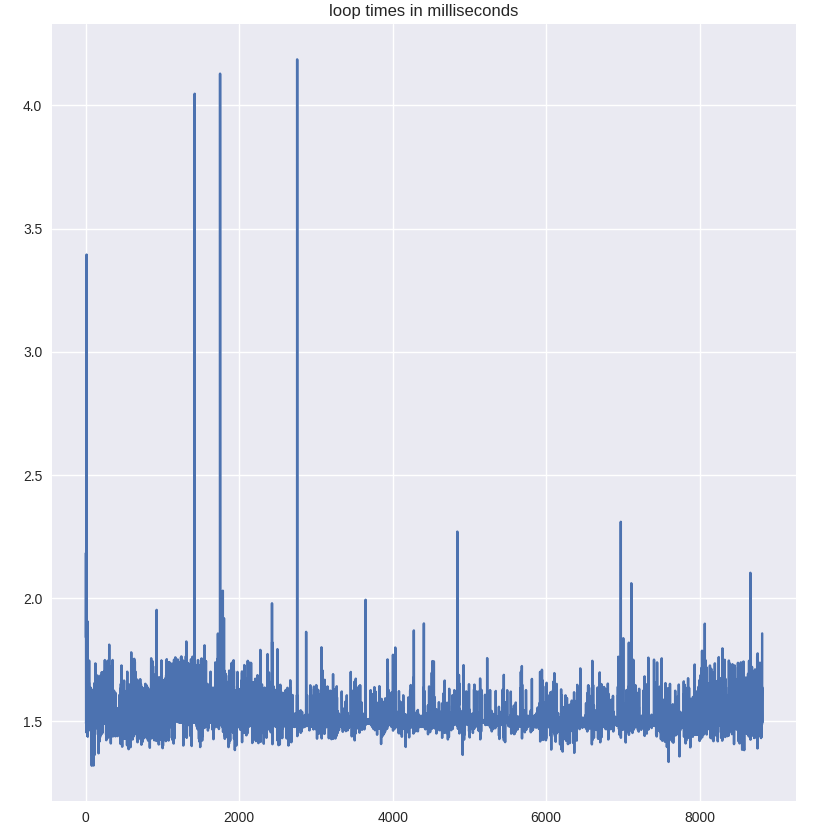

# Foot Design Project

_Code for the hopper being used to test foot designs_

This project was developed by [Alexander Knemeyer](https://github.com/alknemeyer) on a laptop running PopOS (_basically_ Ubuntu). I can't think of a reason why the project wouldn't work under Windows/MacOS, though the commands were all written with Linux in mind. Please don't hesitate to ask me questions!

Read the following four blog posts to get you up and running with Python workflows and embedded dev:
* Communicating with embedded systems using Python, [part 1](https://alknemeyer.github.io/embedded-comms-with-python/) and [part 2](https://alknemeyer.github.io/embedded-comms-with-python-part-2/)
* [A workflow for remote development](https://alknemeyer.github.io/remote-notebooks/)
* [Improving the jupyter notebook workflow](https://alknemeyer.github.io/jupyter-notebook-workflow/)

The last two are themed on "remote" and "jupyter notebook" development, but are useful for this project


## The robot

A rough model of the robot, describing angle conventions, lengths, etc. Made using https://editor.method.ac/ - a free online svg editor. Stick to this! And keep it up to date!

<p align="center">

</p>

### Equipment used

| Item             | Name                                                                |
| ---------------- | ------------------------------------------------------------------- |
| Motor controller | [ODrive](https://odriverobotics.com/)                               |
| Motor x2         | [T-motor U-10 80rpm/V](http://store-en.tmotor.com/goods.php?id=362) |
| Motor encoder x2 | [HEDL-5640-A13](https://www.mouser.co.za/ProductDetail/Broadcom-Avago/HEDL-5640A13?qs=RuhU64sK2%252Bv3nPu5sOD%2FhQ==) |
| Force sensor     | [OptoForce OMD-45-FH-2000N](http://schlu.com/pdf/Optoforce_Sensore_di_forza_3D_OMD-45-FH-2000N_1.5_EN.pdf) |
| Sensor logger    | [Parts list](https://github.com/African-Robotics-Unit/sensor-logger)|


### Wiring things together

The general setup is:
| | | Connection type |
|-|-|----------------:|
| laptop | sensor logger | USB cable |
| laptop | ODrive | USB cable |
| ODrive | motor encoders | Premade connectors. See below |
| ODrive | motors | Three thick wires for each motor |
| ODrive "AUX" port | 10 Ohm shunt resistor | Short thick wires |
| laptop | OptoForce | USB connection |

I can't remember how to do the calculation for the required resistance/power, unfortunately!

The motor encoders have pins as follows:

| pin | type   | | pin | type |
|-----|--------|-|-----|------|
| 1   | NC     | | 2   | +5V  |
| 3   | GND    | | 4   | NC   |
| 5   | not(A) | | 6   | A    |
| 7   | not(B) | | 8   | B    |
| 9   | not(I) | | 10  | I    |

where NC = No Connection, and I = Index = Z

When looking at the connector, they correspond to the diagram below, where crosses over numbers indicates pins which aren't connected:

<p align="center">

</p>

Now, the connection works as follows:

<p align="center">

</p>

Note that the second line from the left (ground, as shown by the hand-drawn diagram) crosses over the lines and ends up at the ground pin of the ODrive. When looking at the robot from the front, the left motor is motor 0 (M0)

There seemed to be noise on the encoder index lines, causing the encoders to "reset" randomly. Capacitors were added (not shown in the diagram) but the index lines are still not working properly


## Software environment setup

### Download this repo
Clone this repo, and make sure to download the submodules too:

    $ git clone --recurse-submodules https://github.com/alknemeyer/foot-design-project

One of the modules is [typesieve](https://github.com/alknemeyer/typesieve) - it contains a bunch of type annotations, which make it easier to work on ODrive code without having it plugged in. Please read the project's README!


### Python
Install conda or miniconda, then either install dependancies manually:

```bash
# create a virtual environment named "foot-design" using
# conda, and activate it
$ conda create --name foot-design
$ conda activate foot-design

# install the main dependancies
$ conda install jupyterlab matplotlib serial sympy

# some dependancies aren't available via conda
# install those via pip:
$ conda install pip
$ python -m pip install --upgrade https://github.com/alknemeyer/optoforce/tarball/main

# IF you want to do trajectory optimisation,
# install the following:
$ python -m pip install odrive physical-education==0.1.2 pyomo
$ conda install -c conda-forge cyipopt  # get ipopt the easy way

# there might be more install instructions for your
# particular OS: https://docs.odriverobotics.com/
# eg. on ubuntu, I have to install "udev rules"

# after you've done that, plug in the ODrive, power it
# externally (ie >=24V from a bench power supply) and
# then enter:
$ odrivetool

# on my laptop, a few lines of errors get displayed saying
# "[stuff] was never awaited", but after ~10 seconds you
# should see something like:
# "Connected to ODrive 20603595524B as odrv0"
# in cyan text. If so -- great! You're connected to the odrive
```

OR start from a conda `environment.yml` file, which will install the exact same versions of dependancies under a virtual environment named `foot-design`:

    $ conda env create --file=environment.yml

If you want to create an environment file to document eg. new or updated dependancies, run

    $ conda env export > environment.yml

If using vs code, you'll need to update the `""python.pythonPath"` setting in `.vscode/settings.json` to your actual virtual environment, or click on a notification if it pops up


### ODrive
You have a choice now - you can keep the software + firmware versions that are being used at the time of writing (ODrive Python library + firmware version 0.4.12) or upgrade to a new version. My feeling is that it's better to use the latest version since that's what the docs reflect, what people on forums will most readily help with, and _probably_ most bug-free. See the instructions on the ODrive website

Tip: if using Ubuntu, you might need to run `odrivetool dfu` with `sudo`! You'll know if you get a bug about `ValueError: The device has no langid`

Moving on: you'll also need to configure and calibrate the motors. Plug them in before running the code in `scripts/config_motors.py`. Do so by either copy-pasting the code into the `odrivetool` REPL, or by just running:

    $ python scripts/config_motors.py

The values in the script come from the from T-motor link above.

N.B: the script should be re-run if you change the power supply! For example, from bench power supply (for testing) to 10kW supply


### Sensor logger
It's probably a good idea to re-flash the sensor logger firmware before you use it (just in case someone else has messed with it). However, if the same firmware is still uploaded, it should just work as is. It can be imported an used as a module (eg. see `controller.py`) or run as main to just log to a file:

    $ python sensor_logger/scripts/receive_comms.py

It should also make a plot of the data


## Control
~~This is where will start to go wrong.~~ I'm sure you'll do great!

First off, read Chris's excellent documentation in the `RAM - Robotic Test Leg` folder, bearing in mind that the documentation was written a ago, and that it's not up to date

Now, there are three ongoing approaches to controlling the leg:

### 1. ODrive's PID control
The "current working" control method is documented in [controller.py](./controller.py), [scripts/lib.py](./scripts/lib.py) and [scripts/test.py](./scripts/test.py). It basically uses the ODrive's built in PID position control and some geometry to place the foot by controlling leg and positions

### 2. Impedance control on motor angles
A "sort of working" approach is a super simple PD current-controller on the motor angles. We get control loop times of around 1.5ms (bearing in mind this is Python, and it'll depend on the speed of your laptop).

<p align="center">

</p>

Anecdotally, the controller is unstable if the control loop time is extended to 10/15 ms via `time.sleep(...)` statements.

If that time is dominated by ODrive stuff (eg blocking comms), then there isn't much we can do. Otherwise, if it's from the Python side, we can experiment with using a different python implementation (like pypy). But no use it in stressing about it until it becomes a problem!

See [`impedance_controller.py`](./impedance_controller.py) for the implementation

### 3. Impedance control of foot position
Last is the "not working but possibly close" controller. The idea is that we define the foot in polar coordinates, and try to make it behave as if it were a spring-damper system with parameters we can set. See [`scripts/impedance-control.ipynb`](./scripts/impedance-control.ipynb) for the derivation and [`impedance_controller.py`](./impedance_controller.py) for the buggy implementation.
